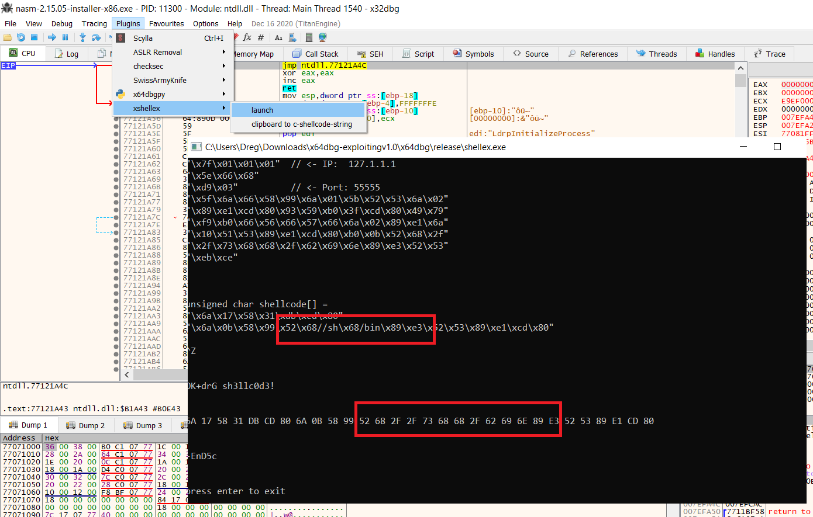
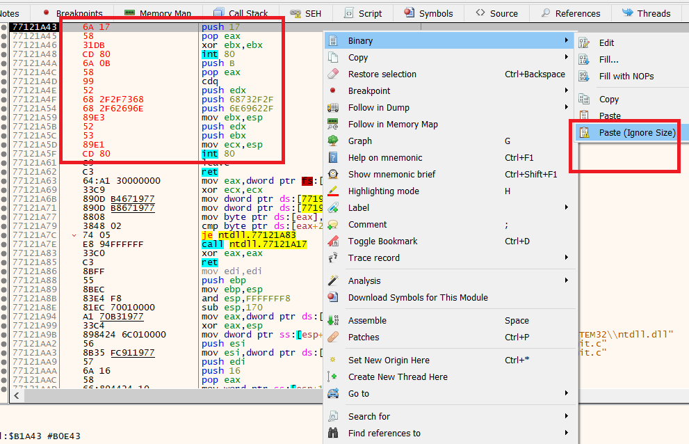
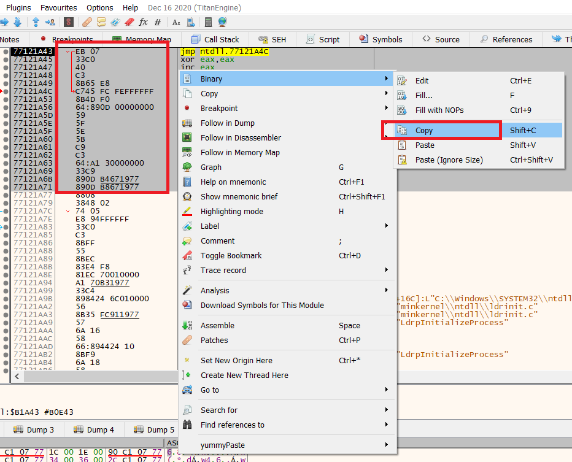
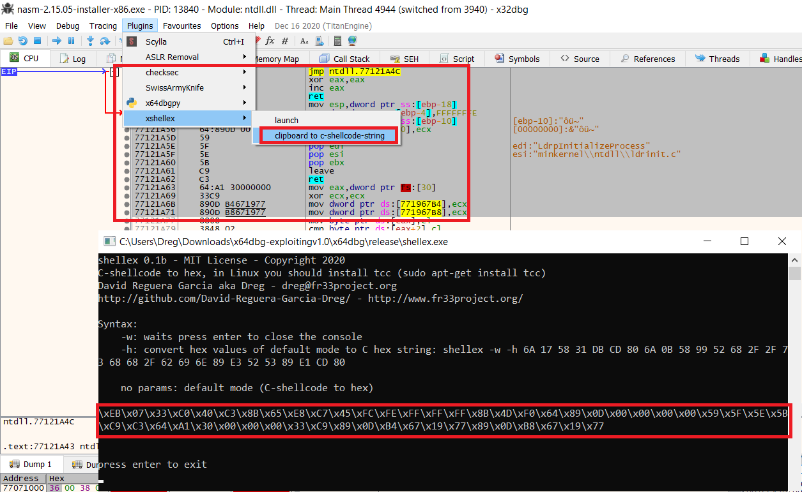

# xshellex
With xshellex you can paste any kind of c-shellcode strings in x64dbg. Also you can convert clipboard "x64dbg-binary-copy" to c-shellcode string.

x64dbg plugin to support shellex c-shellcode converter to HEX:
* https://github.com/David-Reguera-Garcia-Dreg/shellex

You can use this plugin as a complement for yummyPaste. 
* https://github.com/0ffffffffh/yummyPaste

yummyPaste dont support shellcodes like:

```
"\x68//sh\x68/bin\x89\xe3"
```

yummyPaste cant support shellcodes with multi-line + comments:

```
"\x68"
"\x7f\x01\x01\x01"  // <- IP:  127.1.1.1
"\x5e\x66\x68"
"\xd9\x03"          // <- Port: 55555
"\x5f\x6a\x66\x58\x99\x6a\x01\x5b\x52\x53\x6a\x02"
```

But my shellex program can support all kind of c-shellcodes strings.

## Install

Just download https://github.com/David-Reguera-Garcia-Dreg/xshellex/releases/download/0.1b/release.zip

Extract the .zip in the x64dbg folder:

Now check if you have installed:
* x64dbg\release\tcc
* x64dbg\release\shellex.exe
* x64dbg\release\x32\plugins\xshellex.dp32
* x64dbg\release\x64\plugins\xshellex.dp64

## Use

Go to Plugins --> xshellex --> launch

Paste your c-shellcode string

Press enter

Press Control+Z

Copy the output to clipboard



Use x64dbg Binary Paste (right click in disasm)



## Converting clipboard "x64dbg-binary-copy" to c-shellcode string

Select area

Right click --> Binary ---> Copy



Go to Plugins --> xshellex --> clipboard to ....



